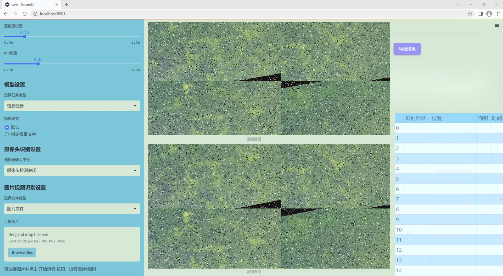
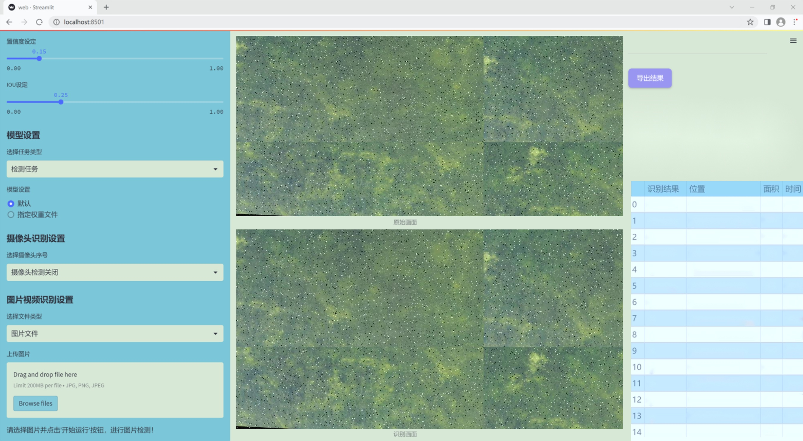
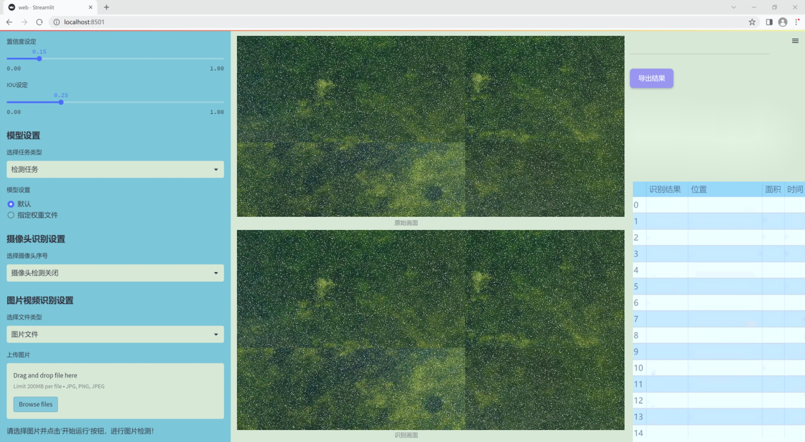
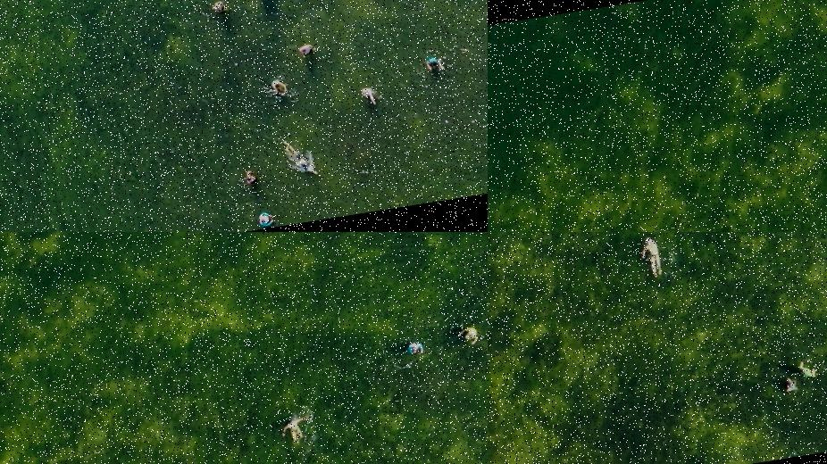
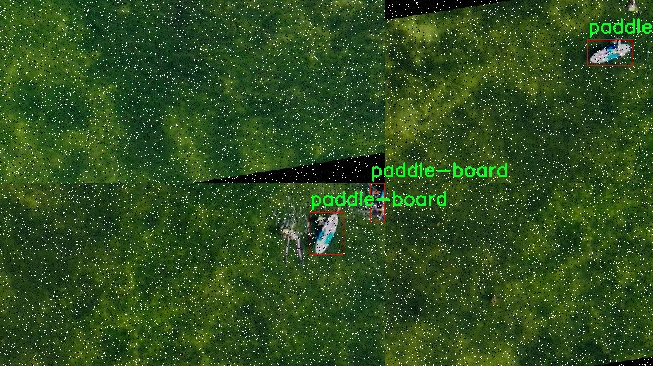
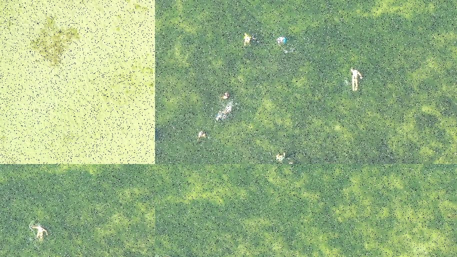
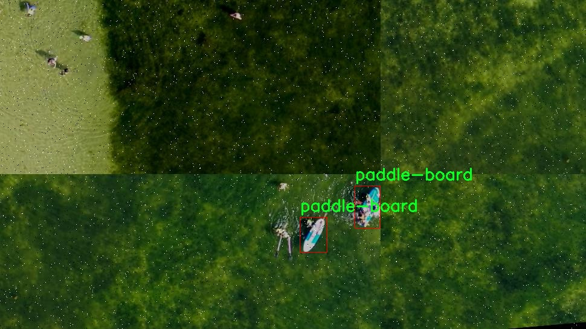
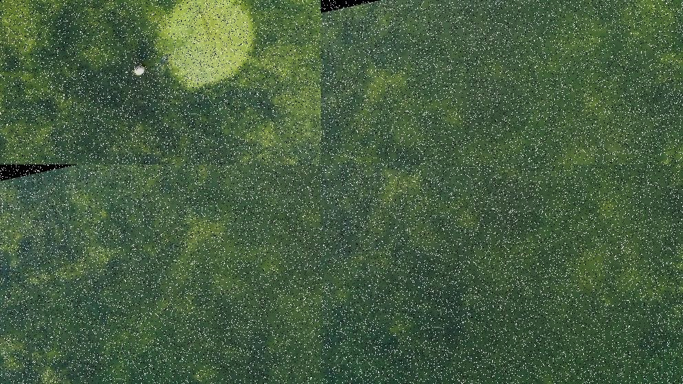

# 改进yolo11-RFCBAMConv等200+全套创新点大全：无人机视角水面漂浮物体检测系统源码＆数据集全套

### 1.图片效果展示







##### 项目来源 **[人工智能促进会 2024.10.22](https://kdocs.cn/l/cszuIiCKVNis)**

##### 注意：由于项目一直在更新迭代，上面“1.图片效果展示”和“2.视频效果展示”展示的系统图片或者视频可能为老版本，新版本在老版本的基础上升级如下：（实际效果以升级的新版本为准）

  （1）适配了YOLOV11的“目标检测”模型和“实例分割”模型，通过加载相应的权重（.pt）文件即可自适应加载模型。

  （2）支持“图片识别”、“视频识别”、“摄像头实时识别”三种识别模式。

  （3）支持“图片识别”、“视频识别”、“摄像头实时识别”三种识别结果保存导出，解决手动导出（容易卡顿出现爆内存）存在的问题，识别完自动保存结果并导出到tempDir中。

  （4）支持Web前端系统中的标题、背景图等自定义修改。

  另外本项目提供训练的数据集和训练教程,暂不提供权重文件（best.pt）,需要您按照教程进行训练后实现图片演示和Web前端界面演示的效果。

### 2.视频效果展示

[2.1 视频效果展示](https://www.bilibili.com/video/BV1hjypYiE2M/)

### 3.背景

研究背景与意义

随着全球水资源的日益紧张和环境污染问题的加剧，水面漂浮物体的监测与管理显得尤为重要。漂浮物体不仅影响水体的生态环境，还可能对水质和水生生物造成严重威胁。因此，开发高效的水面漂浮物体检测系统，能够及时识别和处理水面污染物，具有重要的现实意义和应用价值。近年来，随着无人机技术的快速发展，利用无人机进行水面监测已成为一种新兴的研究方向。无人机搭载高分辨率摄像头，可以从空中获取大范围的水面图像，极大地提高了监测的效率和准确性。

在此背景下，基于改进YOLOv11的无人机视角水面漂浮物体检测系统应运而生。YOLO（You Only Look Once）系列模型因其高效的实时检测能力而广泛应用于目标检测领域。YOLOv11作为该系列的最新版本，具备更强的特征提取能力和更快的推理速度，适合在动态环境中进行漂浮物体的实时检测。通过对YOLOv11模型的改进，可以进一步提升其在水面漂浮物体检测中的准确性和鲁棒性。

本研究将利用“Aerial Data of Floating Objects”数据集，该数据集包含25幅图像，涵盖2类漂浮物体。尽管数据量相对较小，但通过数据增强和迁移学习等技术，可以有效提升模型的泛化能力。此外，研究还将探讨不同环境条件下的检测性能，以确保系统在实际应用中的可靠性和有效性。综上所述，基于改进YOLOv11的无人机视角水面漂浮物体检测系统不仅为水体监测提供了一种创新的解决方案，也为环境保护和水资源管理提供了重要的技术支持。

### 4.数据集信息展示

##### 4.1 本项目数据集详细数据（类别数＆类别名）

nc: 1
names: ['paddle-board']


该项目为【目标检测】数据集，请在【训练教程和Web端加载模型教程（第三步）】这一步的时候按照【目标检测】部分的教程来训练

##### 4.2 本项目数据集信息介绍

本项目数据集信息介绍

本项目所使用的数据集名为“Aerial Data of Floating Objects”，旨在为改进YOLOv11的无人机视角水面漂浮物体检测系统提供高质量的训练数据。该数据集专注于水面漂浮物体的检测，特别是针对一种特定类别的物体——“paddle-board”。在数据集中，类别数量为1，体现了该项目对特定物体的深度学习和精准识别的需求。

“Aerial Data of Floating Objects”数据集包含了多种场景下的无人机拍摄图像，这些图像展示了不同环境条件下的水面及其上漂浮的桨板。数据集中的图像不仅涵盖了不同的光照条件和天气变化，还包括了多种角度和距离的拍摄，确保了模型在实际应用中的鲁棒性。每幅图像都经过精确标注，确保了训练过程中所需的高质量标签信息，从而提升了模型的学习效果。

通过使用这一数据集，研究人员能够有效地训练和优化YOLOv11模型，使其在检测水面漂浮物体时具备更高的准确性和实时性。数据集的设计考虑到了无人机在实际应用中的多样性和复杂性，力求在不同的环境中实现稳定的检测性能。随着无人机技术的不断发展，水面漂浮物体的检测将变得愈发重要，尤其是在海洋监测、环境保护和水上运动等领域。因此，“Aerial Data of Floating Objects”数据集的构建不仅为本项目提供了必要的基础数据支持，也为未来相关研究提供了重要的参考价值。











### 5.全套项目环境部署视频教程（零基础手把手教学）

[5.1 所需软件PyCharm和Anaconda安装教程（第一步）](https://www.bilibili.com/video/BV1BoC1YCEKi/?spm_id_from=333.999.0.0&vd_source=bc9aec86d164b67a7004b996143742dc)


[5.2 安装Python虚拟环境创建和依赖库安装视频教程（第二步）](https://www.bilibili.com/video/BV1ZoC1YCEBw?spm_id_from=333.788.videopod.sections&vd_source=bc9aec86d164b67a7004b996143742dc)

### 6.改进YOLOv11训练教程和Web_UI前端加载模型教程（零基础手把手教学）

[6.1 改进YOLOv11训练教程和Web_UI前端加载模型教程（第三步）](https://www.bilibili.com/video/BV1BoC1YCEhR?spm_id_from=333.788.videopod.sections&vd_source=bc9aec86d164b67a7004b996143742dc)


按照上面的训练视频教程链接加载项目提供的数据集，运行train.py即可开始训练



     Epoch   gpu_mem       box       obj       cls    labels  img_size
     1/200     20.8G   0.01576   0.01955  0.007536        22      1280: 100%|██████████| 849/849 [14:42<00:00,  1.04s/it]
               Class     Images     Labels          P          R     mAP@.5 mAP@.5:.95: 100%|██████████| 213/213 [01:14<00:00,  2.87it/s]
                 all       3395      17314      0.994      0.957      0.0957      0.0843

     Epoch   gpu_mem       box       obj       cls    labels  img_size
     2/200     20.8G   0.01578   0.01923  0.007006        22      1280: 100%|██████████| 849/849 [14:44<00:00,  1.04s/it]
               Class     Images     Labels          P          R     mAP@.5 mAP@.5:.95: 100%|██████████| 213/213 [01:12<00:00,  2.95it/s]
                 all       3395      17314      0.996      0.956      0.0957      0.0845

     Epoch   gpu_mem       box       obj       cls    labels  img_size
     3/200     20.8G   0.01561    0.0191  0.006895        27      1280: 100%|██████████| 849/849 [10:56<00:00,  1.29it/s]
               Class     Images     Labels          P          R     mAP@.5 mAP@.5:.95: 100%|███████   | 187/213 [00:52<00:00,  4.04it/s]
                 all       3395      17314      0.996      0.957      0.0957      0.0845


###### [项目数据集下载链接](https://kdocs.cn/l/cszuIiCKVNis)

### 7.原始YOLOv11算法讲解


2024年9月30日，Ultralytics在其活动YOLOVision中正式发布了YOLOv 11。YOLOv
11是由位于美国和西班牙的Ultralytics团队开发的YOLO的最新版本。YOLO是一种用于基于图像的人工智能的计算机模型。


YOLOv11与其他版本的YOLO相比的性能

##### YOLOv11改进方向

与YOLOv10相比，YOLOv11有了巨大的改进，包括但不限于：

  * 增强的模型结构：模型具有改进的模型结构，以获取图像处理并形成预测

  * GPU优化：这是现代ML模型的反映，GPU训练ML模型在速度和准确性上都更好。

  * 速度：YOLOv 11模型现在经过增强和GPU优化以用于训练。通过优化，这些模型比它们的前版本快得多。在速度上达到了25%的延迟减少！

  * 更少的参数：更少的参数允许更快的模型，但v11的准确性不受影响

  * 更具适应性：更多支持的任务YOLOv 11支持多种类型的任务、多种类型的对象和多种类型的图像。

##### YOLOv11功能介绍

Glenn Jocher和他的团队制作了一个令人敬畏的YOLOv 11迭代，并且在图像人工智能的各个方面都提供了YOLO。YOLOv 11有多种型号，包括：

  * 对象检测-在训练时检测图像中的对象

  * 图像分割-超越对象检测，分割出图像中的对象

  * 姿态检测-当用点和线训练时绘制一个人的姿势

  * 定向检测（OBB）：类似于对象检测，但包围盒可以旋转

  * 图像分类-在训练时对图像进行分类

使用Ultralytics Library，这些模型还可以进行优化，以：

  * 跟踪-可以跟踪对象的路径

  * 易于导出-库可以以不同的格式和目的导出

  * 多场景-您可以针对不同的对象和图像训练模型

此外，Ultralytics还推出了YOLOv 11的企业模型，该模型将于10月31日发布。这将与开源的YOLOv
11模型并行，但将拥有更大的专有Ultralytics数据集。YOLOv 11是“建立在过去的成功”的其他版本的之上。

##### YOLOv11模型介绍

YOLOv 11附带了边界框模型（无后缀），实例分割（-seg），姿态估计（-pose），定向边界框（-obb）和分类（-cls）。

这些也有不同的尺寸：纳米（n），小（s），中（m），大（l），超大（x）。


YOLOv11模型

##### YOLOv11与前版本对比

与YOLOv10和YOLOv8相比，YOLOv11在Ultralytics的任何帖子中都没有直接提到。所以我会收集所有的数据来比较它们。感谢Ultralytics：

**检测：**


YOLOv11检测统计


YOLOv10检测统计

其中，Nano的mAPval在v11上为39.5，v10上为38.5；Small为47.0 vs 46.3，Medium为51.5 vs
51.1，Large为53.4 vs 53.2，Extra Large为54.7vs
54.4。现在，这可能看起来像是一种增量增加，但小小数的增加可能会对ML模型产生很大影响。总体而言，YOLOv11以0.3
mAPval的优势追平或击败YOLOv10。

现在，我们必须看看速度。在延迟方面，Nano在v11上为1.55 , v10上为1.84，Small为2.46 v2.49，Medium为4.70
v4.74，Large为6.16 v7.28，Extra Large为11.31
v10.70。延迟越低越好。YOLOv11提供了一个非常低的延迟相比，除了特大做得相当差的前身。

总的来说，Nano模型是令人振奋的，速度更快，性能相当。Extra Large在性能上有很好的提升，但它的延迟非常糟糕。

**分割：**


YOLOV11 分割统计


YOLOV9 分割统计


YOLOV8 分割数据

总体而言，YOLOv 11上的分割模型在大型和超大型模型方面比上一代YOLOv 8和YOLOv 9做得更好。

YOLOv 9 Segmentation没有提供任何关于延迟的统计数据。比较YOLOv 11延迟和YOLOv 8延迟，发现YOLOv 11比YOLOv
8快得多。YOLOv 11将大量GPU集成到他们的模型中，因此期望他们的模型甚至比CPU测试的基准更快！

**姿态估计：**


YOLOV11姿态估计统计


YOLOV8姿态估计统计

YOLOv 11的mAP 50 -95统计量也逐渐优于先前的YOLOv 8（除大型外）。然而，在速度方面，YOLOv
11姿势可以最大限度地减少延迟。其中一些延迟指标是版本的1/4！通过对这些模型进行GPU训练优化，我可以看到指标比显示的要好得多。

**定向边界框：**


YOLOv11 OBB统计


YOLOv8 OBB统计

OBB统计数据在mAP
50上并不是很好，只有非常小的改进，在某种程度上小于检测中的微小改进。然而，从v8到v11的速度减半，这表明YOLOv11在速度上做了很多努力。

**最后，分类：**


YOLOv 11 CLS统计


YOLOv8 CLS统计

从v8到v11，准确性也有了微小的提高。然而，速度大幅上升，CPU速度更快的型号。


### 8.200+种全套改进YOLOV11创新点原理讲解

#### 8.1 200+种全套改进YOLOV11创新点原理讲解大全

由于篇幅限制，每个创新点的具体原理讲解就不全部展开，具体见下列网址中的改进模块对应项目的技术原理博客网址【Blog】（创新点均为模块化搭建，原理适配YOLOv5~YOLOv11等各种版本）

[改进模块技术原理博客【Blog】网址链接](https://gitee.com/qunmasj/good)


#### 8.2 精选部分改进YOLOV11创新点原理讲解

###### 这里节选部分改进创新点展开原理讲解(完整的改进原理见上图和[改进模块技术原理博客链接](https://gitee.com/qunmasj/good)【如果此小节的图加载失败可以通过CSDN或者Github搜索该博客的标题访问原始博客，原始博客图片显示正常】


### Context_Grided_Network(CGNet)简介
参考该博客提出的一种轻量化语义分割模型Context Grided Network(CGNet)，以满足设备的运行需要。

CGNet主要由CG块构建而成，CG块可以学习局部特征和周围环境上下文的联合特征，最后通过引入全局上下文特征进一步改善联合特征的学习。


 
下图给出了在Cityscapes数据集上对现有的一些语义分割模型的测试效果，横轴表示参数量，纵轴表示准确率(mIoU)。可以看出，在参数量较少的情况下，CGNet可以达到一个比较好的准确率。虽与高精度模型相去甚远，但在一些对精度要求不高、对实时性要求比较苛刻的情况下，很有价值。


高精度模型，如DeepLab、DFN、DenseASPP等，动不动就是几十M的参数，很难应用在移动设备上。而上图中红色的模型，相对内存占用较小，但它们的分割精度却不是很高。作者认为主要原因是，这些小网络大多遵循着分类网络的设计思路，并没有考虑语义分割任务更深层次的特点。

空间依赖性和上下文信息对提高分割精度有很大的作用。作者从该角度出发，提出了CG block，并进一步搭建了轻量级语义分割网络CGNet。CG块具有以下特点： 

学习局部特征和上下文特征的联合特征；
通过全局上下文特征改进上述联合特征；
可以贯穿应用在整个网络中，从low level（空间级别）到high level（语义级别）。不像PSPNet、DFN、DenseASPP等，只在编码阶段以后捕捉上下文特征。；
只有3个下采样，相比一般5个下采样的网络，能够更好地保留边缘信息。
CGNet遵循“深而薄”的原则设计，整个网络又51层构成。其中，为了降低计算，大量使用了channel-wise conv.

小型语义分割模型：

需要平衡准确率和系统开销
进化路线：ENet -> ICNet -> ESPNet
这些模型基本都基于分类网络设计，在分割准确率上效果并不是很好
上下文信息模型：

大多数现有模型只考虑解码阶段的上下文信息并且没有利用周围的上下文信息
注意力机制：

CG block使用全局上下文信息计算权重向量，并使用其细化局部特征和周围上下文特征的联合特征

#### Context Guided Block
CG block由4部分组成：


此外，CG block还采用了残差学习。文中提出了局部残差学习（LRL）和全局残差学习（GRL）两种方式。 LRL添加了从输入到联合特征提取器的连接，GRL添加了从输入到全局特征提取器的连接。从直观上来说，GRL比LRL更能促进网络中的信息传递（更像ResNet~~），后面实验部分也进行了测试，的确GRL更能提升分割精度。


CGNet的通用网络结构如下图所示，分为3个stage，第一个stage使用3个卷积层抽取特征，第二和第三个stage堆叠一定数量的CG block，具体个数可以根据情况调整。最后，通过1x1 conv得到分割结果。


下图是用于Cityscapes数据集的CGNet网络细节说明：输入尺寸为3*680*680；stage1连续使用了3个Conv-BN-PReLU组合，首个组合使用了stride=2的卷积，所以得到了1/2分辨率的feature map；stage2和stage3分别使用了多个CG block，且其中使用了不同大小的膨胀卷积核，最终分别得到了1/4和1/8的feature map。

需注意：

stage2&3的输入特征分别由其上一个stage的首个和最后一个block组合给出（参考上图的绿色箭头）；

输入注入机制，图中未体现，实际使用中，作者还将输入图像下采样1/4或1/8，分别给到stage2和stage3的输入中 ，以进一步加强特征传递。

channel-wise conv。为了缩减参数数量，在局部特征提取器和周围上下文特征提取器中使用了channel-wise卷积，可以消除跨通道的计算成本，同时节省内存占用。但是，没有像MobileNet等模型一样，在depth-wise卷积后面接point-wise卷积（1*1 conv），作者解释是，因为CG block需要保持局部特征和周围上下文特征的独立性，而1*1 conv会破坏这种独立性，所以效果欠佳，实验部分也进行了验证。

个人感觉此处应该指的是depth-wise卷积？

官方Git中对该部分的实现如下：


### 9.系统功能展示

图9.1.系统支持检测结果表格显示

  图9.2.系统支持置信度和IOU阈值手动调节

  图9.3.系统支持自定义加载权重文件best.pt(需要你通过步骤5中训练获得)

  图9.4.系统支持摄像头实时识别

  图9.5.系统支持图片识别

  图9.6.系统支持视频识别

  图9.7.系统支持识别结果文件自动保存

  图9.8.系统支持Excel导出检测结果数据


### 10. YOLOv11核心改进源码讲解

#### 10.1 kernel_warehouse.py

以下是对代码中最核心部分的提取和详细注释。代码主要涉及一个基于注意力机制的卷积神经网络模块和一个仓库管理器，用于动态管理卷积核的权重。

```python
import torch
import torch.nn as nn
import torch.nn.functional as F
import collections.abc

# 定义核心模块
class Attention(nn.Module):
    def __init__(self, in_planes, reduction, num_static_cell, num_local_mixture, norm_layer=nn.BatchNorm1d):
        super(Attention, self).__init__()
        # 计算隐藏层的通道数
        hidden_planes = max(int(in_planes * reduction), 16)
        self.kw_planes_per_mixture = num_static_cell + 1  # 每个混合的通道数
        self.num_local_mixture = num_local_mixture  # 本地混合数
        self.kw_planes = self.kw_planes_per_mixture * num_local_mixture  # 总通道数

        # 定义网络层
        self.avgpool = nn.AdaptiveAvgPool1d(1)  # 自适应平均池化
        self.fc1 = nn.Linear(in_planes, hidden_planes)  # 全连接层
        self.norm1 = norm_layer(hidden_planes)  # 归一化层
        self.act1 = nn.ReLU(inplace=True)  # 激活函数

        # 初始化权重
        self._initialize_weights()

    def _initialize_weights(self):
        # 权重初始化
        for m in self.modules():
            if isinstance(m, nn.Linear):
                nn.init.kaiming_normal_(m.weight, mode='fan_out', nonlinearity='relu')
                if m.bias is not None:
                    nn.init.constant_(m.bias, 0)
            if isinstance(m, nn.BatchNorm1d):
                nn.init.constant_(m.weight, 1)
                nn.init.constant_(m.bias, 0)

    def forward(self, x):
        # 前向传播
        x = self.avgpool(x.reshape(*x.shape[:2], -1)).squeeze(dim=-1)  # 池化
        x = self.act1(self.norm1(self.fc1(x)))  # 线性变换 + 归一化 + 激活
        return x  # 返回处理后的特征

class KWconvNd(nn.Module):
    def __init__(self, in_planes, out_planes, kernel_size, stride=1, padding=0, dilation=1, groups=1):
        super(KWconvNd, self).__init__()
        self.in_planes = in_planes  # 输入通道数
        self.out_planes = out_planes  # 输出通道数
        self.kernel_size = kernel_size  # 卷积核大小
        self.stride = stride  # 步幅
        self.padding = padding  # 填充
        self.dilation = dilation  # 膨胀
        self.groups = groups  # 分组卷积

    def forward(self, x):
        # 前向传播
        weight = self.get_weight()  # 获取权重
        output = F.conv2d(x, weight, stride=self.stride, padding=self.padding, groups=self.groups)  # 卷积操作
        return output  # 返回卷积结果

class Warehouse_Manager(nn.Module):
    def __init__(self):
        super(Warehouse_Manager, self).__init__()
        self.warehouse_list = {}  # 存储卷积核的仓库

    def reserve(self, in_planes, out_planes, kernel_size=1, stride=1, padding=0, groups=1):
        # 创建卷积层并记录其信息
        weight_shape = [out_planes, in_planes, kernel_size, kernel_size]  # 权重形状
        self.warehouse_list['default'] = weight_shape  # 存储权重形状
        return KWconvNd(in_planes, out_planes, kernel_size, stride, padding, groups)  # 返回卷积层

    def take_cell(self):
        # 获取卷积核
        return self.warehouse_list['default']  # 返回默认仓库的卷积核

# 使用示例
wm = Warehouse_Manager()  # 创建仓库管理器
conv_layer = wm.reserve(3, 16, kernel_size=3)  # 创建卷积层
```

### 代码核心部分说明：
1. **Attention类**：实现了一个注意力机制，用于对输入特征进行加权处理。包含了多个层（全连接层、归一化层和激活函数），并在前向传播中计算注意力权重。
  
2. **KWconvNd类**：实现了一个可扩展的卷积层，支持动态管理卷积核的权重。其前向传播中调用了PyTorch的卷积函数。

3. **Warehouse_Manager类**：用于管理卷积核的仓库，支持动态创建和存储卷积层的权重信息。可以根据输入参数生成相应的卷积层。

### 总结：
以上代码展示了如何构建一个动态卷积网络，利用注意力机制来增强特征提取能力，同时通过仓库管理器来管理卷积核的权重，便于在不同层之间共享和复用卷积核。

这个文件 `kernel_warehouse.py` 是一个用于实现深度学习中卷积操作的模块，特别是涉及到“内核仓库”（Kernel Warehouse）管理的卷积层。它主要包括几个类和函数，下面是对这些内容的逐一分析。

首先，文件导入了一些必要的库，包括 PyTorch 的核心模块和一些数学函数。接着，定义了一个 `parse` 函数，用于处理输入参数，确保它们是可迭代的，并根据需要将其扩展到指定的长度。

接下来，定义了一个 `Attention` 类，这是一个神经网络模块，负责计算注意力权重。它的构造函数接受多个参数，包括输入通道数、缩减比例、静态单元数量、局部混合数量等。该类的主要功能是通过全连接层和激活函数对输入进行处理，并生成注意力权重，这些权重用于后续的卷积操作。

`KWconvNd` 类是一个抽象的卷积层类，继承自 `nn.Module`。它的构造函数接受输入和输出通道数、卷积核大小、步幅、填充、扩张、分组等参数，并初始化相应的属性。该类的 `init_attention` 方法用于初始化注意力机制，`forward` 方法则实现了前向传播过程，利用注意力权重和仓库中的卷积核进行卷积操作。

随后，定义了三个具体的卷积类 `KWConv1d`、`KWConv2d` 和 `KWConv3d`，分别对应一维、二维和三维卷积操作。这些类通过设置不同的维度和排列方式来实现具体的卷积功能。

`KWLinear` 类是一个线性层的实现，内部使用 `KWConv1d` 来实现线性变换。

`Warehouse_Manager` 类是整个模块的核心，负责管理卷积层的内核仓库。它的构造函数接受多个参数，用于配置仓库的行为。该类的 `reserve` 方法用于创建动态卷积层而不分配权重，并记录相关信息。`store` 方法则用于计算并存储仓库中的权重。`allocate` 方法负责将权重分配给网络中的卷积层。

最后，`KWConv` 类是一个高层次的卷积封装，结合了卷积层、批归一化和激活函数。它的 `forward` 方法实现了输入的前向传播。

此外，文件中还定义了一个 `get_temperature` 函数，用于根据当前的训练迭代和总的训练周期计算温度值，这在某些训练策略中可能用于调整模型的学习率或其他超参数。

总体而言，这个文件实现了一个灵活的卷积层管理系统，允许动态地管理和分配卷积核，适用于需要优化卷积操作的深度学习模型。

#### 10.2 pkinet.py

以下是经过简化并添加详细中文注释的核心代码部分：

```python
import math
import torch
import torch.nn as nn

class DropPath(nn.Module):
    """实现随机深度（Drop Path）机制的模块，适用于残差块的主路径。"""
    
    def __init__(self, drop_prob: float = 0.1):
        super().__init__()
        self.drop_prob = drop_prob  # 路径被置零的概率

    def forward(self, x: torch.Tensor) -> torch.Tensor:
        """前向传播，应用随机深度机制。"""
        if self.drop_prob == 0. or not self.training:
            return x  # 如果不丢弃路径，直接返回输入
        keep_prob = 1 - self.drop_prob
        shape = (x.shape[0], ) + (1, ) * (x.ndim - 1)  # 处理不同维度的张量
        random_tensor = keep_prob + torch.rand(shape, dtype=x.dtype, device=x.device)
        output = x.div(keep_prob) * random_tensor.floor()  # 应用随机丢弃
        return output

class ConvFFN(nn.Module):
    """使用卷积模块实现的多层感知机（Feed Forward Network）。"""
    
    def __init__(self, in_channels: int, out_channels: int, hidden_channels_scale: float = 4.0, dropout_rate: float = 0.):
        super().__init__()
        hidden_channels = int(in_channels * hidden_channels_scale)  # 隐藏层通道数

        self.ffn_layers = nn.Sequential(
            nn.LayerNorm(in_channels),  # 归一化层
            nn.Conv2d(in_channels, hidden_channels, kernel_size=1),  # 1x1卷积
            nn.ReLU(),  # 激活函数
            nn.Dropout(dropout_rate),  # Dropout层
            nn.Conv2d(hidden_channels, out_channels, kernel_size=1),  # 1x1卷积
            nn.Dropout(dropout_rate),  # Dropout层
        )

    def forward(self, x):
        """前向传播，应用FFN层。"""
        return self.ffn_layers(x)

class PKIBlock(nn.Module):
    """多核Inception模块，结合了卷积和注意力机制。"""
    
    def __init__(self, in_channels: int, out_channels: int):
        super().__init__()
        self.conv1 = nn.Conv2d(in_channels, out_channels, kernel_size=1)  # 1x1卷积
        self.conv2 = nn.Conv2d(out_channels, out_channels, kernel_size=3, padding=1)  # 3x3卷积
        self.ffn = ConvFFN(out_channels, out_channels)  # 前馈网络

    def forward(self, x):
        """前向传播，应用Inception模块。"""
        x = self.conv1(x)
        x = self.conv2(x)
        x = self.ffn(x)
        return x

class PKINet(nn.Module):
    """多核Inception网络的实现。"""
    
    def __init__(self):
        super().__init__()
        self.stem = nn.Conv2d(3, 32, kernel_size=3, stride=2, padding=1)  # Stem层
        self.block1 = PKIBlock(32, 64)  # 第一个Inception块
        self.block2 = PKIBlock(64, 128)  # 第二个Inception块

    def forward(self, x):
        """前向传播，依次通过Stem层和多个Inception块。"""
        x = self.stem(x)
        x = self.block1(x)
        x = self.block2(x)
        return x

def PKINET_T():
    """创建并返回一个T型的PKINet模型。"""
    return PKINet()

if __name__ == '__main__':
    model = PKINET_T()  # 实例化模型
    inputs = torch.randn((1, 3, 640, 640))  # 创建输入张量
    res = model(inputs)  # 通过模型进行前向传播
    print(res.size())  # 输出结果的尺寸
```

### 代码说明：
1. **DropPath**: 实现了随机深度的机制，能够在训练过程中随机丢弃某些路径，以增强模型的泛化能力。
2. **ConvFFN**: 实现了一个简单的前馈网络，包含了层归一化、卷积层和激活函数。
3. **PKIBlock**: 这是一个多核Inception模块，结合了多个卷积层和前馈网络，旨在提取特征。
4. **PKINet**: 这是整个网络的主体，包含了Stem层和多个Inception块，负责处理输入并生成输出。
5. **PKINET_T**: 用于创建一个特定配置的PKINet模型。

通过这些核心模块的组合，构建了一个具有多层特征提取能力的深度学习模型。

这个程序文件 `pkinet.py` 实现了一个名为 PKINet 的深度学习模型，主要用于图像处理任务。该模型的结构基于多种卷积模块和注意力机制，旨在提高图像特征提取的能力。以下是对代码的详细说明。

首先，文件导入了一些必要的库，包括 `math`、`torch` 和 `torch.nn`，以及一些可选的模块。通过 `try-except` 语句，程序尝试导入来自 `mmcv` 和 `mmengine` 的一些组件，这些组件通常用于构建和训练深度学习模型。如果导入失败，则使用 PyTorch 的基本模块。

接下来，定义了一些实用函数和类。`drop_path` 函数实现了随机深度（Stochastic Depth）机制，用于在训练过程中随机丢弃某些路径，以增强模型的泛化能力。`DropPath` 类则封装了这一功能，使其可以作为一个可训练的模块。

`autopad` 函数用于自动计算卷积层的填充，以确保输出尺寸与输入尺寸相符。`make_divisible` 函数确保通道数是可被指定除数整除的，常用于模型设计中以优化计算效率。

接下来的几个类（如 `BCHW2BHWC` 和 `BHWC2BCHW`）用于处理张量的维度转换，以适应不同的卷积操作。`GSiLU` 类实现了一种新的激活函数，结合了全局平均池化和 Sigmoid 激活。

`CAA` 类实现了上下文锚点注意力机制，通过多个卷积层和池化层来计算注意力因子。`ConvFFN` 类则实现了一个多层感知机，使用卷积模块来替代传统的全连接层。

`Stem` 和 `DownSamplingLayer` 类分别定义了模型的初始层和下采样层，后者用于减小特征图的尺寸并增加通道数。`InceptionBottleneck` 类实现了带有多个卷积核的瓶颈结构，增强了模型的特征提取能力。

`PKIBlock` 类是一个核心模块，结合了前述的各个组件，构成了多核的 Inception 结构。`PKIStage` 类则将多个 `PKIBlock` 组合在一起，形成模型的一个阶段。

`PKINet` 类是整个模型的主体，包含多个阶段，并定义了模型的架构设置。该类的构造函数接受多个参数，包括模型的架构类型、输出索引、随机丢弃率等。根据不同的架构设置，模型会动态构建相应的层和模块。

最后，文件提供了三个函数 `PKINET_T`、`PKINET_S` 和 `PKINET_B`，分别用于创建不同规模的 PKINet 模型。`__main__` 部分用于测试模型的创建和前向传播，生成随机输入并输出各层的尺寸。

整体而言，这个文件实现了一个复杂的深度学习模型，采用了多种现代卷积神经网络的设计理念，旨在提升图像处理任务的性能。

#### 10.3 lsknet.py

以下是代码中最核心的部分，并附上详细的中文注释：

```python
import torch
import torch.nn as nn
from functools import partial

class Mlp(nn.Module):
    """多层感知机（MLP）模块"""
    def __init__(self, in_features, hidden_features=None, out_features=None, act_layer=nn.GELU, drop=0.):
        super().__init__()
        out_features = out_features or in_features  # 输出特征数默认为输入特征数
        hidden_features = hidden_features or in_features  # 隐藏层特征数默认为输入特征数
        self.fc1 = nn.Conv2d(in_features, hidden_features, 1)  # 第一层卷积
        self.dwconv = DWConv(hidden_features)  # 深度卷积
        self.act = act_layer()  # 激活函数
        self.fc2 = nn.Conv2d(hidden_features, out_features, 1)  # 第二层卷积
        self.drop = nn.Dropout(drop)  # Dropout层

    def forward(self, x):
        x = self.fc1(x)  # 通过第一层卷积
        x = self.dwconv(x)  # 通过深度卷积
        x = self.act(x)  # 激活
        x = self.drop(x)  # Dropout
        x = self.fc2(x)  # 通过第二层卷积
        x = self.drop(x)  # 再次Dropout
        return x

class Attention(nn.Module):
    """注意力模块"""
    def __init__(self, d_model):
        super().__init__()
        self.proj_1 = nn.Conv2d(d_model, d_model, 1)  # 投影层1
        self.activation = nn.GELU()  # 激活函数
        self.spatial_gating_unit = LSKblock(d_model)  # 空间门控单元
        self.proj_2 = nn.Conv2d(d_model, d_model, 1)  # 投影层2

    def forward(self, x):
        shortcut = x.clone()  # 保留输入以便后续残差连接
        x = self.proj_1(x)  # 通过投影层1
        x = self.activation(x)  # 激活
        x = self.spatial_gating_unit(x)  # 通过空间门控单元
        x = self.proj_2(x)  # 通过投影层2
        x = x + shortcut  # 残差连接
        return x

class Block(nn.Module):
    """网络的基本块，包括注意力和MLP"""
    def __init__(self, dim, mlp_ratio=4., drop=0., drop_path=0., act_layer=nn.GELU):
        super().__init__()
        self.norm1 = nn.BatchNorm2d(dim)  # 第一层归一化
        self.norm2 = nn.BatchNorm2d(dim)  # 第二层归一化
        self.attn = Attention(dim)  # 注意力模块
        self.drop_path = nn.Identity() if drop_path <= 0. else DropPath(drop_path)  # 随机深度
        mlp_hidden_dim = int(dim * mlp_ratio)  # MLP隐藏层维度
        self.mlp = Mlp(in_features=dim, hidden_features=mlp_hidden_dim, act_layer=act_layer, drop=drop)  # MLP模块

    def forward(self, x):
        x = x + self.drop_path(self.attn(self.norm1(x)))  # 通过注意力模块并添加残差
        x = x + self.drop_path(self.mlp(self.norm2(x)))  # 通过MLP模块并添加残差
        return x

class LSKNet(nn.Module):
    """LSKNet模型"""
    def __init__(self, img_size=224, in_chans=3, embed_dims=[64, 128, 256, 512], depths=[3, 4, 6, 3]):
        super().__init__()
        self.num_stages = len(embed_dims)  # 网络阶段数
        for i in range(self.num_stages):
            # 创建每个阶段的嵌入层和块
            patch_embed = OverlapPatchEmbed(img_size=img_size // (2 ** i), in_chans=in_chans if i == 0 else embed_dims[i - 1], embed_dim=embed_dims[i])
            block = nn.ModuleList([Block(dim=embed_dims[i]) for _ in range(depths[i])])  # 创建多个Block
            setattr(self, f"patch_embed{i + 1}", patch_embed)  # 将嵌入层添加到模型中
            setattr(self, f"block{i + 1}", block)  # 将Block添加到模型中

    def forward(self, x):
        outs = []
        for i in range(self.num_stages):
            patch_embed = getattr(self, f"patch_embed{i + 1}")  # 获取嵌入层
            block = getattr(self, f"block{i + 1}")  # 获取Block
            x, H, W = patch_embed(x)  # 嵌入输入
            for blk in block:
                x = blk(x)  # 通过每个Block
            outs.append(x)  # 保存输出
        return outs

class DWConv(nn.Module):
    """深度卷积模块"""
    def __init__(self, dim=768):
        super(DWConv, self).__init__()
        self.dwconv = nn.Conv2d(dim, dim, 3, 1, 1, bias=True, groups=dim)  # 深度卷积

    def forward(self, x):
        return self.dwconv(x)  # 通过深度卷积

# 定义模型的构造函数
def lsknet_t(weights=''):
    model = LSKNet(embed_dims=[32, 64, 160, 256], depths=[3, 3, 5, 2])  # 创建LSKNet模型
    if weights:
        model.load_state_dict(torch.load(weights)['state_dict'])  # 加载权重
    return model

if __name__ == '__main__':
    model = lsknet_t('lsk_t_backbone-2ef8a593.pth')  # 实例化模型并加载权重
    inputs = torch.randn((1, 3, 640, 640))  # 创建随机输入
    for i in model(inputs):
        print(i.size())  # 打印每个阶段的输出尺寸
```

### 代码核心部分解释：
1. **Mlp类**：实现了一个多层感知机模块，包含两个卷积层和一个深度卷积层，使用GELU激活函数和Dropout。
2. **Attention类**：实现了一个注意力机制模块，包含两个投影层和一个空间门控单元（LSKblock）。
3. **Block类**：构建了一个基本的网络块，结合了注意力模块和MLP，使用BatchNorm进行归一化。
4. **LSKNet类**：构建了整个网络架构，包含多个阶段，每个阶段由嵌入层和多个Block组成。
5. **DWConv类**：实现了深度卷积，用于在MLP中进行特征提取。
6. **lsknet_t函数**：用于创建LSKNet模型并加载预训练权重。

通过这些核心模块的组合，构成了一个完整的神经网络模型。

这个程序文件 `lsknet.py` 实现了一个名为 LSKNet 的深度学习模型，主要用于图像处理任务。代码中使用了 PyTorch 框架，定义了多个类和函数来构建和管理模型的结构和功能。

首先，文件导入了必要的库，包括 PyTorch 的核心模块和一些辅助函数。接着，定义了几个重要的类。

`Mlp` 类实现了一个多层感知机（MLP），它包含两个卷积层和一个深度卷积层（DWConv），并使用 GELU 激活函数和 Dropout 层。这个类的 `forward` 方法定义了数据流经 MLP 的过程。

`LSKblock` 类是模型的一个核心组件，包含多个卷积层和注意力机制。它通过空间卷积和通道卷积提取特征，并使用 sigmoid 函数生成的权重对特征进行加权组合。这个类的 `forward` 方法实现了特征的处理和加权。

`Attention` 类实现了一个注意力机制，包含两个卷积层和一个 LSKblock。它通过对输入进行投影、激活和注意力计算，增强了特征的表达能力。

`Block` 类结合了归一化、注意力机制和 MLP，构成了模型的基本构建块。它在 `forward` 方法中使用了残差连接和随机丢弃路径（DropPath）来增强模型的鲁棒性。

`OverlapPatchEmbed` 类负责将输入图像转换为补丁嵌入。它使用卷积层将图像分割成多个补丁，并进行归一化处理。

`LSKNet` 类是整个模型的主类，定义了模型的结构，包括不同阶段的嵌入、块和归一化层。它在初始化时根据输入参数设置各个阶段的特征维度、深度和其他超参数。`forward` 方法负责将输入数据通过各个阶段进行处理，并返回不同阶段的输出。

`DWConv` 类实现了深度卷积操作，作为特征提取的一部分。

`update_weight` 函数用于更新模型的权重，确保加载的权重与模型的结构匹配。

最后，`lsknet_t` 和 `lsknet_s` 函数分别定义了两种不同配置的 LSKNet 模型，并提供了加载预训练权重的功能。

在文件的最后部分，提供了一个简单的测试代码，创建了一个 LSKNet 模型实例，并对随机生成的输入数据进行前向传播，打印输出的尺寸。这部分代码可以用于验证模型的基本功能和结构是否正确。

整体来看，这个文件实现了一个复杂的深度学习模型，结合了多种现代神经网络设计理念，如注意力机制、残差连接和多层感知机，适合用于图像分类、目标检测等任务。

#### 10.4 test_selective_scan_easy.py

以下是经过简化和注释的核心代码部分：

```python
import torch
import torch.nn.functional as F

def selective_scan_easy(us, dts, As, Bs, Cs, Ds, delta_bias=None, delta_softplus=False, return_last_state=False, chunksize=64):
    """
    执行选择性扫描操作。
    
    参数:
    us: 输入张量，形状为 (B, G * D, L)
    dts: 时间增量张量，形状为 (B, G * D, L)
    As: 系数矩阵，形状为 (G * D, N)
    Bs: 系数矩阵，形状为 (B, G, N, L)
    Cs: 系数矩阵，形状为 (B, G, N, L)
    Ds: 系数矩阵，形状为 (G * D)
    delta_bias: 偏置项，形状为 (G * D)
    delta_softplus: 布尔值，指示是否应用 softplus 激活
    return_last_state: 布尔值，指示是否返回最后的状态
    chunksize: 每次处理的序列长度
    
    返回:
    输出张量和（可选）最后状态
    """
    
    def selective_scan_chunk(us, dts, As, Bs, Cs, hprefix):
        """
        处理每个块的选择性扫描。
        
        参数:
        us: 输入张量块
        dts: 时间增量块
        As, Bs, Cs: 系数矩阵
        hprefix: 前一个状态
        
        返回:
        当前块的输出和状态
        """
        ts = dts.cumsum(dim=0)  # 计算时间增量的累积和
        Ats = torch.einsum("gdn,lbgd->lbgdn", As, ts).exp()  # 计算指数
        rAts = Ats  # 归一化
        duts = dts * us  # 计算增量
        dtBus = torch.einsum("lbgd,lbgn->lbgdn", duts, Bs)  # 计算中间结果
        hs_tmp = rAts * (dtBus / rAts).cumsum(dim=0)  # 计算状态
        hs = hs_tmp + Ats * hprefix.unsqueeze(0)  # 更新状态
        ys = torch.einsum("lbgn,lbgdn->lbgd", Cs, hs)  # 计算输出
        return ys, hs

    # 数据类型设置
    dtype = torch.float32
    inp_dtype = us.dtype
    has_D = Ds is not None
    if chunksize < 1:
        chunksize = Bs.shape[-1]  # 如果 chunksize 小于 1，使用 L

    # 处理输入数据
    dts = dts.to(dtype)
    if delta_bias is not None:
        dts = dts + delta_bias.view(1, -1, 1).to(dtype)  # 添加偏置
    if delta_softplus:
        dts = F.softplus(dts)  # 应用 softplus 激活

    # 调整输入张量的形状
    Bs = Bs.unsqueeze(1) if len(Bs.shape) == 3 else Bs
    Cs = Cs.unsqueeze(1) if len(Cs.shape) == 3 else Cs
    B, G, N, L = Bs.shape
    us = us.view(B, G, -1, L).permute(3, 0, 1, 2).to(dtype)
    dts = dts.view(B, G, -1, L).permute(3, 0, 1, 2).to(dtype)
    As = As.view(G, -1, N).to(dtype)
    Bs = Bs.permute(3, 0, 1, 2).to(dtype)
    Cs = Cs.permute(3, 0, 1, 2).to(dtype)
    Ds = Ds.view(G, -1).to(dtype) if has_D else None

    oys = []  # 存储输出
    hprefix = us.new_zeros((B, G, D, N), dtype=dtype)  # 初始化状态
    for i in range(0, L, chunksize):
        ys, hs = selective_scan_chunk(
            us[i:i + chunksize], dts[i:i + chunksize], 
            As, Bs[i:i + chunksize], Cs[i:i + chunksize], hprefix, 
        )
        oys.append(ys)  # 收集输出
        hprefix = hs[-1]  # 更新状态

    oys = torch.cat(oys, dim=0)  # 合并输出
    if has_D:
        oys = oys + Ds * us  # 添加 D 的影响
    oys = oys.permute(1, 2, 3, 0).view(B, -1, L)  # 调整输出形状

    return oys.to(inp_dtype) if not return_last_state else (oys.to(inp_dtype), hprefix.view(B, G * D, N).float())
```

### 代码说明
1. **selective_scan_easy**: 该函数实现了选择性扫描的核心逻辑，输入为多个张量，输出为经过处理的张量。
2. **selective_scan_chunk**: 这是一个内部函数，用于处理每个块的输入数据，计算输出和状态。
3. **数据处理**: 在函数开始时，输入数据会被转换为适当的形状和数据类型，确保计算的正确性。
4. **循环处理**: 使用循环遍历输入数据的块，逐步更新输出和状态。
5. **返回值**: 最后，函数返回处理后的输出张量和（可选的）最后状态。

这个简化版本保留了核心逻辑，同时通过注释解释了每个部分的功能。

这个程序文件 `test_selective_scan_easy.py` 实现了一个名为 `selective_scan_easy` 的函数，并通过一系列的测试用例来验证其正确性。该函数主要用于处理序列数据的选择性扫描，涉及到深度学习中的张量运算和反向传播。以下是对代码的详细说明。

首先，文件导入了一些必要的库，包括 `torch`、`pytest` 和 `einops`。这些库提供了张量操作、测试框架和张量重排功能。

接下来，定义了 `selective_scan_easy` 函数。该函数的输入包括多个张量，如 `us`、`dts`、`As`、`Bs`、`Cs` 和 `Ds`，它们分别代表不同的参数和状态。函数的核心逻辑在于通过选择性扫描的方式，计算出输出张量 `oys` 和最后的状态 `hprefix`。

在 `selective_scan_easy` 函数内部，定义了一个嵌套函数 `selective_scan_chunk`，该函数负责处理数据的分块计算。它使用了张量的累积和和指数运算来更新状态，并计算输出。通过对输入张量的维度和形状进行调整，确保它们符合计算要求。

函数的参数中还包括一些可选项，如 `delta_bias` 和 `delta_softplus`，用于调整输入数据。计算过程中，如果 `delta_bias` 不为 `None`，则会将其添加到 `dts` 中；如果 `delta_softplus` 为 `True`，则会对 `dts` 应用 softplus 激活函数。

函数的输出包括计算得到的 `oys` 和（可选的）最后状态 `hprefix`。这些输出经过必要的形状调整，以确保它们符合预期的格式。

接下来，定义了一个 `SelectiveScanEasy` 类，继承自 `torch.autograd.Function`，用于实现自定义的前向和反向传播。这个类的 `forward` 方法实现了选择性扫描的前向计算，而 `backward` 方法则实现了反向传播的梯度计算。反向传播中，使用了保存的中间结果来计算各个输入的梯度。

在文件的后半部分，定义了一些辅助函数，如 `selective_scan_easy_fwdbwd` 和 `selective_scan_ref`，用于不同版本的选择性扫描实现和参考实现。它们提供了与 `selective_scan_easy` 类似的功能，但可能在实现细节上有所不同。

最后，使用 `pytest` 框架定义了一系列测试用例，确保 `selective_scan_easy` 函数的输出与参考实现的输出一致。测试用例涵盖了多种输入情况，包括不同的张量维度、是否使用偏置、是否使用 softplus 等。通过这些测试，可以验证函数的正确性和鲁棒性。

总的来说，这个程序文件实现了一个复杂的选择性扫描算法，并通过自动微分和测试框架确保其正确性，适用于深度学习中的序列数据处理任务。

注意：由于此博客编辑较早，上面“10.YOLOv11核心改进源码讲解”中部分代码可能会优化升级，仅供参考学习，以“11.完整训练+Web前端界面+200+种全套创新点源码、数据集获取”的内容为准。

### 11.完整训练+Web前端界面+200+种全套创新点源码、数据集获取


# [下载链接：https://mbd.pub/o/bread/Zp2bkp5q](https://mbd.pub/o/bread/Zp2bkp5q)